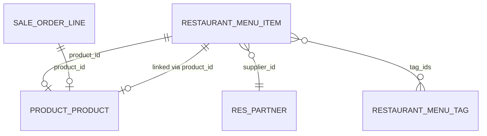
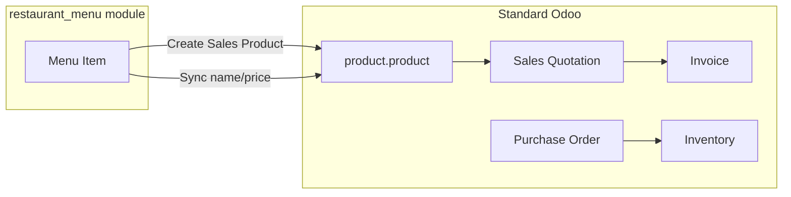

# Restaurant Menu — Odoo 17 Learning & PFE Project

Custom Odoo 17 module for a Moroccan restaurant SME: menu management, Sales integration, PDF reports, JSON API, cron jobs, and row-level security.

**Author:** Hamza  
**Stack:** Odoo 17 · Python · PostgreSQL · Docker · QWeb · XML

---

## E1 — Project scope

### Business problem

A restaurant needs to:

- Manage dishes (name, category, price, cost, tags, supplier)
- Connect the menu to **Sales** (quotations, invoices)
- Track **ingredients** and **purchases** (standard Odoo apps)
- Print a **menu PDF** and expose data via **API**

### Solution

| Layer | What |
|-------|------|
| **Custom module** `restaurant_menu` | Chef-facing menu app |
| **Standard Odoo** | Sales, Inventory, Purchase, Accounting, POS |
| **Integration** | Dishes → Sales products → quotation lines show dish category |

### Target audience (PFE / internship)

Demonstrates both **Odoo user** skills (CRM, Sales, Inventory, Purchase) and **Odoo developer** skills (models, views, inheritance, wizards, reports, controllers, cron, record rules).

---

## E2 — Architecture

### Module structure

```
addons/restaurant_menu/
├── __manifest__.py              # Module metadata, dependencies
├── models/
│   ├── menu_item.py             # Main dish model + business logic
│   ├── menu_tag.py              # Tags (Many2many)
│   ├── partner.py               # Extend Contacts (One2many dishes)
│   └── sale_order_line.py       # Extend quotation lines (computed fields)
├── views/                       # UI (forms, lists, menus)
├── security/                    # Access rights, groups, record rules
├── wizard/                      # Bulk create Sales products (TransientModel)
├── report/                      # QWeb PDF menu
├── controllers/                 # JSON API (/restaurant/menu)
└── data/                        # Demo tags, scheduled cron
```

### Data model (simplified)



### Business flow



### Odoo skills covered

| Category | Topics implemented |
|----------|-------------------|
| **Models** | Char, Float, Selection, Many2one, One2many, Many2many, computed |
| **Logic** | Constraints, onchange, write override, button actions, cron |
| **Views** | Form, tree, menu, view inherit (`_inherit`) |
| **Security** | `ir.model.access.csv`, groups, record rules |
| **Advanced** | Wizard, QWeb PDF, HTTP controller, scheduled action |

---

## Quick start

### Prerequisites

- [Docker Desktop](https://www.docker.com/products/docker-desktop/)

### Run Odoo

```bash
git clone https://github.com/Hamza-spc/odoo-restaurant.git
cd odoo-restaurant
docker compose up -d
```

Open **http://localhost:8069**

| Setting | Value |
|---------|--------|
| Master password | `odoo123` |
| Database | `odoo_dev` (create on first visit) |
| Demo data | No (recommended) |

### Install the module

1. **Settings → Developer Tools → Activate developer mode**
2. **Apps → Update Apps List**
3. Search `restaurant_menu` → **Install**
4. Also install (for full demo): **Sales**, **Inventory**, **Purchase**, **Accounting**, **Point of Sale**

### Useful commands

```bash
docker compose up -d          # start
docker compose down           # stop
docker compose restart odoo   # after Python model changes
docker compose logs -f odoo   # view logs (cron warnings appear here)
```

After changing **Python** files: `docker compose restart odoo` then **Upgrade** the module in Apps.

---

## E3 — Demo script (5–10 minutes)

Use this for PFE defense or internship interviews.

### Intro (30 sec)

> "I built an Odoo 17 module for restaurant menu management for a Moroccan SME. The chef manages dishes; Sales uses the same data on quotations and invoices. I also integrated standard apps: Inventory, Purchase, and Accounting."

---

### Part 1 — Custom module (3 min)

1. **Restaurant Menu → Menu Items**
   - Show dishes: name, category, price, cost, margin, supplier, tags
   - Open **tajine** → explain **margin** is computed (`price - cost`)

2. **Create Sales Product** (or **Bulk Create Products**)
   - Explain: Sales uses `product.product`; our module links dish → product

3. **Contacts → MARJANE HOLDING**
   - Show **Supplied Dishes** (One2many from our module)

4. **Print Menu PDF**
   - PDF with all dishes (QWeb report)

5. **Browser:** `http://localhost:8069/restaurant/menu`
   - JSON API (controller) for external apps

---

### Part 2 — Sales flow (2 min)

1. **Sales → Quotations → New**
   - Customer: MARJANE HOLDING
   - Line: tajine × 30
   - Point out **Dish Category** column (extended `sale.order.line`)

2. **Confirm** → **Create Invoice** → **Register Payment**

> "Same CRM → Sales → Invoice flow as standard Odoo, but dish metadata comes from our custom module."

---

### Part 3 — Supply chain (2 min)

1. **Inventory → Tomates** → On Hand quantity
2. **Purchase → PO to Marjane** → Receive → stock increases

> "Inventory tracks ingredients; Purchase restocks from suppliers. Dishes and ingredients are separate but part of one ERP."

---

### Part 4 — Security & automation (1 min)

1. **Check Missing Products** → popup if dishes lack Sales products
2. Mention **daily cron** logs warnings in server logs
3. Optional: log in as **waiter@test.com** → sees **drinks only** (record rule)

---

### Closing (30 sec)

> "The module uses Odoo best practices: manifest, models, security, views, inheritance, wizards, reports, controllers, cron, and record rules. Code is on GitHub with Docker setup for reproducible demo."

---

## E5 — Interview Q&A prep

### ERP / concepts

**Q: What is an ERP?**  
A: One system that connects business departments (sales, inventory, accounting, HR) with a single database. Example: when Sales confirms an order, Inventory and Accounting can update automatically.

**Q: What is the difference between CRM and Sales?**  
A: CRM tracks leads and opportunities before the sale. Sales handles quotations, orders, and invoicing after the deal progresses.

**Q: Module vs model in Odoo?**  
A: A **module** is an installable app (`restaurant_menu`). A **model** is a data table inside it (`restaurant.menu.item` = dishes).

---

### Technical Odoo

**Q: What is `_inherit`?**  
A: Extending an existing model or view without modifying Odoo core. I used it on `res.partner` (show supplied dishes) and `sale.order.line` (show dish category).

**Q: Many2one vs One2many vs Many2many?**  
A: Many2one = foreign key (dish → supplier). One2many = reverse list (supplier → dishes). Many2many = many-to-many (dish ↔ tags) with a join table.

**Q: What is the difference between constraint and onchange?**  
A: Constraint runs on **save** and blocks invalid data. Onchange runs **in the form** while editing and suggests values (e.g. default price by category).

**Q: Why restart Odoo after changing Python models?**  
A: The running server caches Python code. Restart reloads models before Upgrade applies DB changes.

**Q: `ir.model.access.csv` vs record rules?**  
A: Access CSV = can this group use the model at all? Record rules = which **rows** they see (e.g. waiters see drinks only).

---

### This project specifically

**Q: Why link dishes to `product.product`?**  
A: Sales quotations only use products, not custom tables. The link lets the chef manage menu while Sales uses standard flows.

**Q: What does the JSON controller do?**  
A: `GET /restaurant/menu` returns all dishes as JSON for a website or mobile app without Odoo UI.

**Q: What would you add next?**  
A: Recipe/BOM (ingredients per dish), link Inventory consumption to sales, Moroccan payroll/localization, or a customer-facing menu website.

---

## Learning path completed

| Phase | Topic | Status |
|-------|--------|--------|
| 1–2 | ERP concepts + Odoo Online | Done |
| 3 | Custom module from scratch | Done |
| A | Relations + inheritance | Done |
| B | Sales integration | Done |
| C | Constraints, onchange, computed, wizard, report, controller, cron, rules | Done |
| D | Inventory, Purchase, POS, Accounting, Settings | Done |
| E | Portfolio & demo | Done |

---

## License

LGPL-3 (same as Odoo modules)
